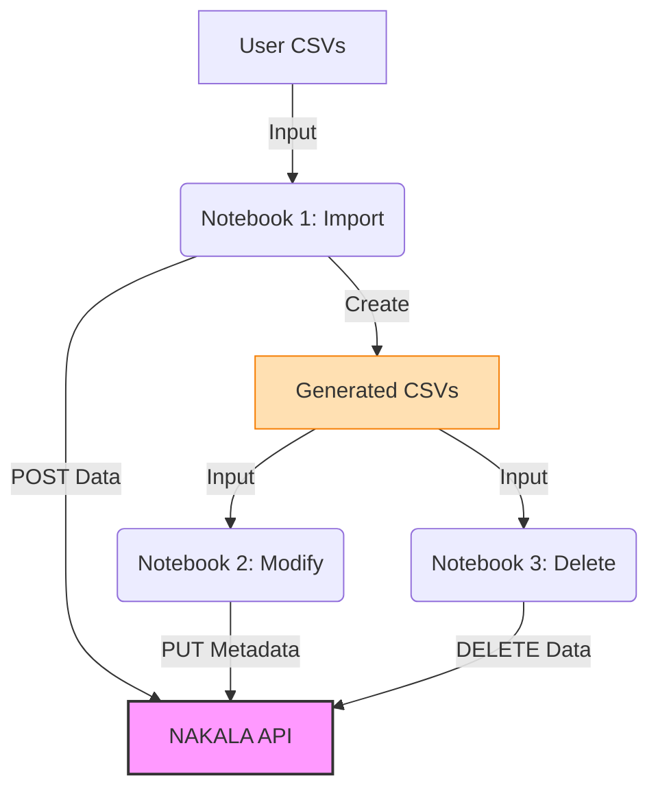

# NAKALA Workshop - Jupyter Notebook Edition

> **🎓 TRAINING KIT**: A complete "Train the Trainer" resource for teaching NAKALA API batch operations.

**Interactive workshop for learning NAKALA API batch operations**

This workshop provides Jupyter notebooks for hands-on learning of NAKALA API batch operations, making it ideal for interactive teaching and practice. It is designed as a **self-contained training kit** for instructors and learners.

---

## 🎯 What You'll Learn

Execute a complete NAKALA workflow step-by-step:
1. **Import** datasets and collections from CSV files
2. **Modify** metadata using generated CSV files
3. **Delete** resources for cleanup

**Key Feature**: Uses the **exact same code** as production scripts, so what you learn applies directly to real-world use.

---

## ✨ Why This Workshop?

This workshop **complements** the [official NAKALA documentation](https://documentation.huma-num.fr/nakala/) by providing a streamlined approach for batch operations.

| Approach | Best For | How It Works |
|----------|----------|--------------|
| **Official Tutorials** | Learning API fundamentals, custom integrations | Manual JSON construction in your code |
| **This Workshop** | Batch operations, non-developers, researchers managing many datasets | CSV → Auto-converted to JSON |

### Key Innovation: The `nakala` Python Package

The workshop's `nakala` package provides a **CSV-to-JSON conversion engine** that:
- **Parses multilingual fields** automatically: `en:Title\|fr:Titre` → valid JSON-LD
- **Handles structured data**: `Surname, Given (ORCID)` → NAKALA creator format
- **Pre-validates** your data before API submission
- **Reusable**: Import it in your own scripts for production workflows

This abstraction lets you focus on your **data content** rather than API syntax—ideal for researchers managing multiple datasets.

---

## 🔄 Workflow

This workshop follows the universal NAKALA API batch operations workflow:



1. **Import**: Create datasets and collections from CSV → Generates modification/deletion CSVs
2. **Modify**: Update metadata using generated CSVs → Apply changes to NAKALA
3. **Delete**: Clean up resources using generated CSVs → Remove from NAKALA

**See**: [Complete Workflow Documentation](docs/workflow.md) for detailed API operations and data flow.

---

## 🛡️ Standards & Compliance

This workshop is fully compliant with Huma-Num's official standards.

-   **Metadata**: Aligns with the [Official Metadata Guide](https://documentation.huma-num.fr/nakala-guide-de-description/).
-   **API**: Uses official [NAKALA Test API](https://apitest.nakala.fr/doc) endpoints.
-   **Single Source of Truth**: For definitive metadata standards, always refer to the [Official NAKALA Documentation](https://documentation.huma-num.fr/nakala/).

## 📦 Reusable `nakala` Package

This kit includes a custom Python package (`nakala/`) that abstracts complex API logic.

-   **For Learners**: Focus on the workflow, not the boilerplate code.
-   **For Developers**: You can **reuse this package** in your own scripts! It handles authentication, file uploads, and metadata formatting for you.

---

## 🚀 Quick Start

### Prerequisites

- Python 3.7+
- Jupyter Notebook
- Internet connection (for NAKALA test API)

### Installation

**Step-by-step setup** (works for everyone):

```bash
# 1. Navigate to workshop directory
cd o-nakala-workshop

# 2. Create virtual environment
python3 -m venv venv

# 3. Activate virtual environment
source venv/bin/activate     # On macOS/Linux
# OR
venv\Scripts\activate        # On Windows

# 4. Install all dependencies (including Jupyter)
pip install jupyter requests python-dotenv ipywidgets pandas

# 5. Start Jupyter
jupyter notebook
```

**When Jupyter asks "Select Kernel":**
- Choose `Python 3` or the first Python option
- Click "Select"

**After the workshop:**
```bash
# Deactivate virtual environment
deactivate

# Optional: Remove virtual environment to clean up
rm -rf venv
```


### Run the Workshop

Execute notebooks in order:

### Step 1: Import (`notebooks/1_batch_import.ipynb`)
- Reads `folder_data_items.csv` and `folder_collections.csv`
- Uploads files and creates datasets/collections on NAKALA
- **Auto-generates** `modification_*.csv` and `delete_*.csv` for next steps

### Step 2: Modify (`notebooks/2_batch_modify.ipynb`)
- **Edit** the generated `modification_*.csv` files (change titles, descriptions, etc.)
- Applies your changes to NAKALA resources
- See your modifications reflected on the server

### Step 3: Delete (`notebooks/3_batch_delete.ipynb`)
- Uses `delete_*.csv` files to clean up
- Removes all created resources from NAKALA
- Safe cleanup for workshop environment

---

## 🤝 For Instructors

### Recommended Workshop Flow

This workshop is designed for a **3-hour interactive session**:

#### Part 1: Introduction (30 min)
- **Slides**: NAKALA overview, API concepts, workshop goals
- **Show**: [Workflow diagram](docs/workflow.md) to explain the big picture

#### Part 2: Live Demonstration (30 min)

Run demonstration scripts to show the workflow in action:

```bash
# Option A: Quick overview (recommended for beginners)
python demonstrations/complete_nakala_lifecycle_demo.py

# Option B: Detailed walkthrough (for in-depth training)
python demonstrations/dataset_lifecycle_demo.py
python demonstrations/collection_lifecycle_demo.py
python demonstrations/incremental_metadata_demo.py
```

**See**: [demonstrations/README.md](demonstrations/README.md) for complete guide

#### Part 3: Hands-on Practice (60-90 min)
- **Notebook 1**: Participants create datasets/collections
- **Notebook 2**: Participants modify metadata
- **Notebook 3**: Participants clean up

**Tips**:
- Send setup instructions to participants 1-2 days before
- Allow time for troubleshooting during setup (see [docs/troubleshooting.md](docs/troubleshooting.md))
- Circulate to help participants during hands-on time
- Encourage participants to edit CSV files between notebooks to see real effects
- Emphasize real-world applicability of the batch workflow

#### Part 4: Advanced Topics (Optional, 30 min)
```bash
# Show advanced patterns
python demonstrations/metadata_modification_comparison.py
python demonstrations/rights_management_demo.py
```

### Teaching Resources

- **[demonstrations/](demonstrations/)** - Live coding scripts for instructor-led demos
- **[docs/](docs/)** - Comprehensive documentation for participants
- **[docs/workflow.md](docs/workflow.md)** - Visual workflow diagram for slides

---

## 📂 Project Structure

```
o-nakala-workshop/
├── README.md
├── requirements.txt
├── .gitignore
├── demonstrations/               # 🎬 Live demo scripts for instructors
│   ├── README.md
│   ├── complete_nakala_lifecycle_demo.py
│   ├── dataset_lifecycle_demo.py
│   ├── collection_lifecycle_demo.py
│   ├── incremental_metadata_demo.py
│   ├── metadata_modification_comparison.py
│   └── rights_management_demo.py
├── docs/                         # 📚 Comprehensive documentation
│   ├── README.md
│   ├── workflow.md
│   ├── csv_format_guide.md
│   ├── quick_reference.md
│   ├── troubleshooting.md
│   ├── metadata_fields.md
│   ├── rest_api_basics.md
│   ├── patch_vs_put.md
│   └── database_sync.md
├── notebooks/                    # 📓 Hands-on practice
│   ├── 1_batch_import.ipynb
│   ├── 2_batch_modify.ipynb
│   └── 3_batch_delete.ipynb
├── data/                         # 📄 CSV files
│   ├── folder_data_items.csv
│   ├── folder_collections.csv
│   ├── modification_*.csv        # Generated by notebook 1
│   └── delete_*.csv              # Generated by notebook 1
├── files/                        # 📁 Sample files for upload
└── nakala/                       # 🔧 Python package for API
```

---


## 📝 CSV Files Explained

### Input CSVs (You Prepare)
- `folder_data_items.csv` - Dataset metadata (title, creator, date, license, type, etc.)
- `folder_collections.csv` - Collection metadata

### Generated CSVs (Auto-created by Notebook 1)
- `modification_data_items.csv` - Dataset IDs + metadata for modification
- `modification_collections.csv` - Collection IDs + metadata for modification
- `delete_data_items.csv` - Dataset IDs for deletion
- `delete_collections.csv` - Collection IDs for deletion

**Key Insight**: The workflow auto-generates CSVs with NAKALA IDs, so you don't need to manually copy IDs between steps!

---

## 🌐 NAKALA Test API

This workshop uses the **safe test environment**:
- **URL**: `https://apitest.nakala.fr`
- **API Key**: Included in notebooks (test key)
- **Safe**: No risk to production data

---

## 🎓 Learning Objectives

By completing this workshop, you will:
- ✅ Understand NAKALA's data model (datasets, collections, metadata)
- ✅ Know the 5 mandatory metadata fields for publication
- ✅ Create datasets and collections via CSV files
- ✅ Modify metadata using CSV-driven workflow
- ✅ Manage complete resource lifecycle (create → modify → delete)
- ✅ Apply this knowledge to real research data management

---

## 🔗 Next Steps

After completing this workshop, you'll receive:
- **Production scripts** for batch operations on your own data
- **Technical documentation** for advanced NAKALA API usage
- **Best practices** for research data management

---


## 📄 License

MIT License - See [LICENSE](LICENSE) file

**Copyright**: LIAO Shueh-Ying

---

## 🐛 Troubleshooting

**Jupyter won't start?**
```bash
pip install --upgrade jupyter
```

**Import errors?**
```bash
pip install -r requirements.txt
```

**API connection issues?**
- Check internet connection
- Verify API key in notebooks

**CSV format questions?**
- See examples in `data/` directory
- Refer to CSV field specifications

---

**Ready to start?** → Open `notebooks/1_batch_import.ipynb` in Jupyter!
