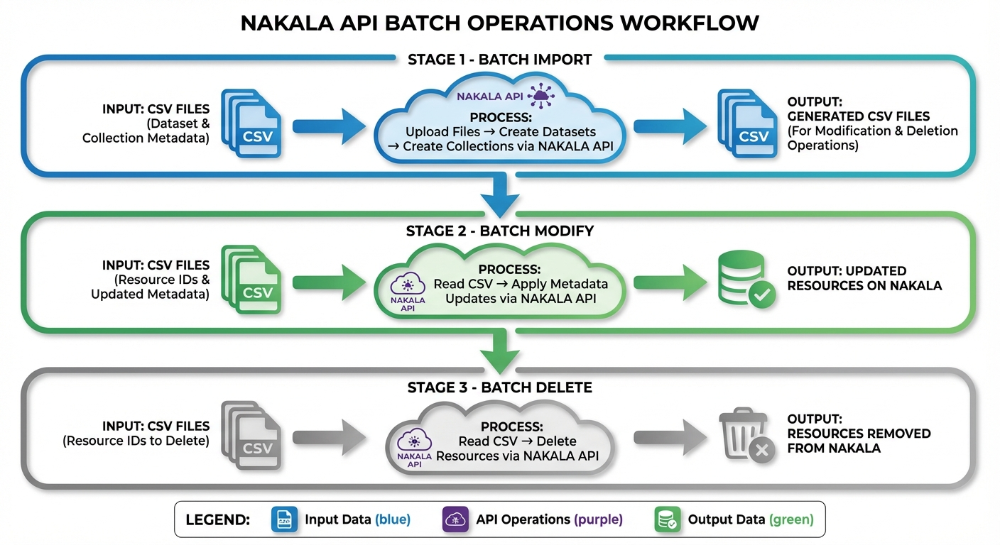
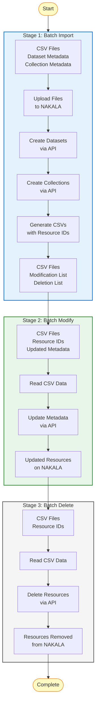

# NAKALA API Batch Operations Workflow

## Overview

This document describes the universal workflow for batch operations with the NAKALA API, applicable to any research data management scenario.

---

## Visual Workflow



---

## Three-Stage Process

### Stage 1: Batch Import

**Purpose**: Create datasets and collections from CSV files

**Input**: 
- CSV files with dataset metadata
- CSV files with collection metadata
- Files to upload

**Process**:
1. Upload files to NAKALA (`POST /datas/uploads`)
2. Create datasets (`POST /datas`)
3. Create collections (`POST /collections`)
4. Link datasets to collections
5. Generate CSVs with assigned resource IDs

**Output**:
- CSV files with resource IDs for modification
- CSV files with resource IDs for deletion

---

### Stage 2: Batch Modify

**Purpose**: Update metadata for existing resources

**Input**:
- CSV files with resource IDs
- Updated metadata values

**Process**:
1. Read CSV data
2. For each resource:
   - Retrieve current metadata (`GET /datas/{id}`)
   - Apply updates (`PATCH` or `PUT /datas/{id}`)
3. Verify changes

**Output**:
- Updated resources on NAKALA

---

### Stage 3: Batch Delete

**Purpose**: Remove resources from NAKALA

**Input**:
- CSV files with resource IDs to delete

**Process**:
1. Read CSV data
2. For each resource:
   - Verify resource status (`GET /datas/{id}`)
   - Delete resource (`DELETE /datas/{id}`)
3. Confirm deletions

**Output**:
- Resources removed from NAKALA

---

## API Operations Reference

### Stage 1: Import Operations

| Operation | HTTP Method | Endpoint | Description |
|-----------|-------------|----------|-------------|
| Upload file | POST | `/datas/uploads` | Upload file to temporary storage |
| Create dataset | POST | `/datas` | Create new dataset with metadata |
| Create collection | POST | `/collections` | Create new collection |
| Add to collection | POST | `/collections/{id}/datas` | Link dataset(s) to collection (body: array of IDs) |

### Stage 2: Modify Operations

| Operation | HTTP Method | Endpoint | Description |
|-----------|-------------|----------|-------------|
| Get metadata | GET | `/datas/{id}` | Retrieve current metadata |
| Update metadata | PATCH/PUT | `/datas/{id}` | Update dataset metadata |
| Verify changes | GET | `/datas/{id}` | Confirm updates applied |

### Stage 3: Delete Operations

| Operation | HTTP Method | Endpoint | Description |
|-----------|-------------|----------|-------------|
| Check status | GET | `/datas/{id}` | Verify resource status |
| Delete dataset | DELETE | `/datas/{id}` | Remove dataset (pending only) |
| Delete collection | DELETE | `/collections/{id}` | Remove collection |

---

## Key Principles

1. **CSV-Driven**: All batch operations use CSV files for data input/output
2. **ID Propagation**: Stage 1 generates resource IDs used in Stages 2 & 3
3. **Sequential**: Stages must execute in order (1 → 2 → 3)
4. **API-Based**: All operations use NAKALA REST API endpoints
5. **Reversible**: Stage 3 provides cleanup capability

---

## Data Flow

```
CSV Input Files
      ↓
  NAKALA API
      ↓
Generated CSV Files (with IDs)
      ↓
  NAKALA API (modifications)
      ↓
Updated Resources
      ↓
  NAKALA API (deletions)
      ↓
Clean Environment
```

---

## Use Cases

This workflow applies to:

- ✅ Research data management
- ✅ Digital humanities projects
- ✅ Archive digitization
- ✅ Collection migration
- ✅ Metadata batch updates
- ✅ Repository management
- ✅ Any NAKALA batch operations

---

## Mermaid Diagram

For embedding in documentation or presentations:



---

## Related Documentation

- [CSV Format Guide](csv_format_guide.md) - CSV file specifications
- [Quick Reference](quick_reference.md) - API basics and mandatory fields
- [REST API Basics](rest_api_basics.md) - HTTP methods and concepts
- [PATCH vs PUT](patch_vs_put.md) - Understanding modification operations
